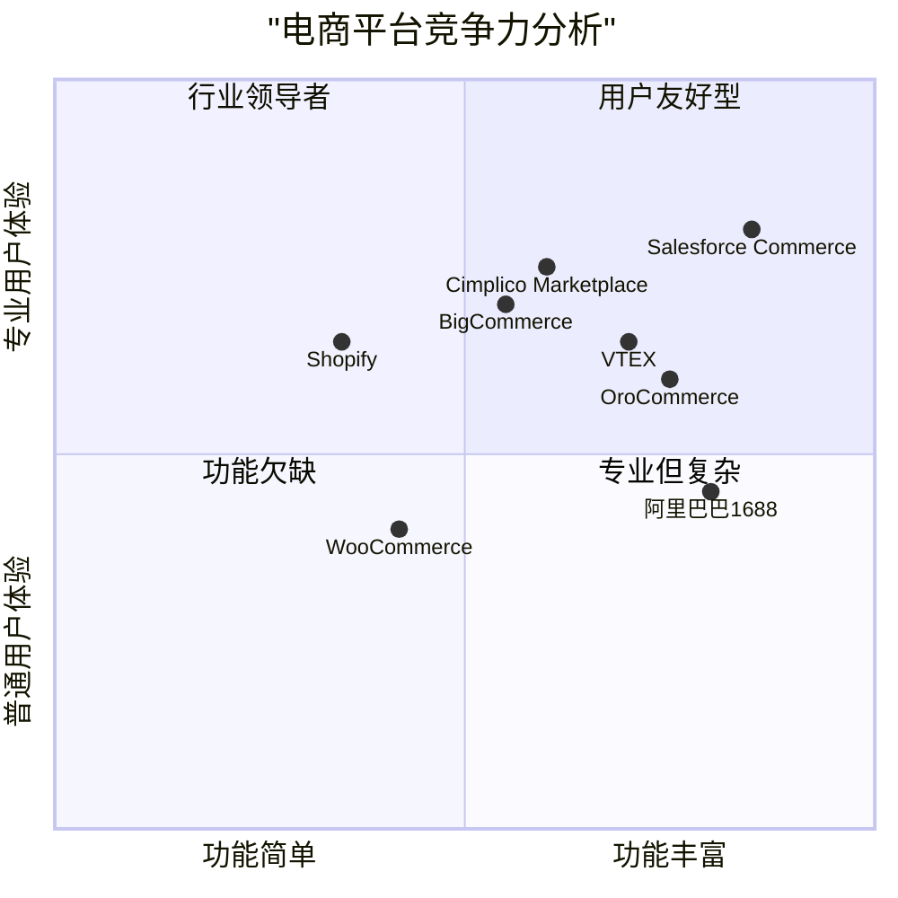
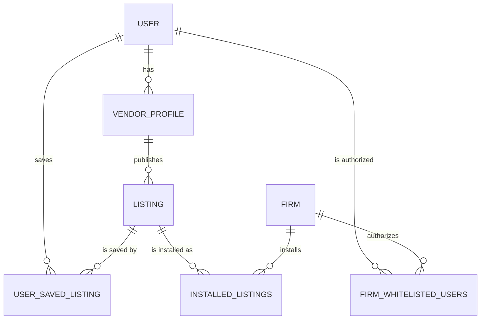

# Cimplico Marketplace PRD文档

## 项目概述

**项目名称：** cimplico_marketplace

**项目类型：** 电子商务平台 (B2B/B2C Marketplace)

**编程语言：** React, JavaScript, Tailwind CSS

**原始需求：** 根据提供的数据库设计和功能表，开发一个完整的商城系统，支持用户、商家和管理员三种角色，包含完整的电商流程和API接口。

## 1. 产品定义

### 1.1 产品目标

1. **建立高效B2B/B2C交易平台**：创建一个连接用户与商家的电商平台，提供安全、便捷的在线交易环境
2. **打造专业化行业垂直市场**：专注于特定行业（如会计、税务、咨询等）的专业服务和产品交易
3. **建立完整的商家验证与管理体系**：通过严格的商家审核机制确保平台商品和服务质量

### 1.2 用户故事

1. **作为普通用户**，我希望能够浏览和搜索商品，以便找到我需要的专业服务和产品
2. **作为普通用户**，我希望能够收藏感兴趣的商品并管理我的订单，以便更好地跟踪我的购买记录和喜好
3. **作为商家**，我希望能够方便地管理我的店铺和商品信息，以便高效运营我的在线业务
4. **作为商家**，我希望能够查看销售数据和订单信息，以便了解我的经营状况并做出调整
5. **作为管理员**，我希望能够审核商家资质和商品信息，以确保平台内容的合规性和质量

### 1.3 竞品分析

| 平台名称 | 优势 | 劣势 |
|---------|------|------|
| Salesforce Commerce | 强大的CRM集成能力、高级个性化功能 | 价格昂贵、配置复杂、中小企业难以承担 |
| BigCommerce | 使用广泛、B2B支付选项完善、API驱动架构 | 自定义功能有限、高级功能需额外付费 |
| OroCommerce | 多渠道支持、工作流自动化、内置CRM | 学习曲线陡峭、配置要求高 |
| VTEX | 全面的商务功能、多租户架构 | 价格信息不透明、本地化支持有限 |
| Shopify Plus | 易用性高、app生态丰富 | B2B功能相对有限、自定义度受限 |
| WooCommerce | 开源免费、WordPress集成、插件丰富 | 扩展性和性能挑战、安全性需自行加强 |
| 阿里巴巴1688 | 供应链资源丰富、B2B领域强大 | 国际化程度有限、用户体验较复杂 |

### 1.4 竞争力象限图



## 2. 技术规格

### 2.1 需求分析

Cimplico Marketplace是一个专注于特定行业的电子商务平台，允许供应商上传和销售他们的产品，用户可以浏览、购买这些产品。平台支持用户、商家和管理员三种角色，每种角色拥有不同的功能和权限。

系统需要支持商品管理、用户管理、订单处理、支付功能、评论系统以及审核机制。同时，需要提供完整的API接口文档，以便未来系统扩展和集成。

### 2.2 需求池

#### 用户模块

| 需求ID | 需求描述 | 优先级 |
|-------|---------|-------|
| U-001 | 用户注册/登录功能，支持邮箱注册和验证 | P0 |
| U-002 | 用户浏览商品列表和详情页 | P0 |
| U-003 | 用户收藏商品功能，可管理收藏列表 | P1 |
| U-004 | 用户查看历史订单及交易详情 | P1 |
| U-005 | 用户对商品发表评论，包含敏感词/违规校验 | P1 |
| U-006 | 用户支付功能，支持多种支付方式 | P0 |
| U-007 | 用户举报违规商品，触发管理员审核 | P2 |

#### 商家模块

| 需求ID | 需求描述 | 优先级 |
|-------|---------|-------|
| V-001 | 商家注册和资质提交功能 | P0 |
| V-002 | 商家个人中心，包含店铺信息和审核状态 | P0 |
| V-003 | 商品信息管理（CRUD），支持分类/状态过滤 | P0 |
| V-004 | 查看商品销售记录和订单详情 | P1 |
| V-005 | 订单管理，包含发货、确认订单完成等功能 | P0 |

#### 管理员模块

| 需求ID | 需求描述 | 优先级 |
|-------|---------|-------|
| A-001 | 商家注册审核功能，可标注不合格项 | P0 |
| A-002 | 商品审核功能，支持通过/拒绝并填写理由 | P0 |
| A-003 | 处理用户举报的商品，支持强制下架或恢复 | P1 |
| A-004 | 数据统计功能，统计商家销售额和用户消费额 | P0 |
| A-005 | 商家管理功能，支持编辑和删除商家 | P0 |
| A-006 | 查看商家销售详细记录 | P0 |
| A-007 | API文档管理，支持一键开关文档访问 | P1 |

### 2.3 UI设计草图

#### 用户端首页布局

```
+--------------------------------------------------+
|  Logo          搜索栏            登录  注册  购物车  |
+--------------------------------------------------+
|                导航菜单                           |
+--------------------------------------------------+
|                                                  |
|  [轮播广告/促销信息]                                |
|                                                  |
+--------------------------------------------------+
|  热门分类                                         |
|  +--------+  +--------+  +--------+  +--------+  |
|  | 分类1   |  | 分类2   |  | 分类3   |  | 分类4   |  |
|  +--------+  +--------+  +--------+  +--------+  |
+--------------------------------------------------+
|  推荐商品                                         |
|  +--------+  +--------+  +--------+  +--------+  |
|  | 商品图片 |  | 商品图片 |  | 商品图片 |  | 商品图片 |  |
|  | 商品名称 |  | 商品名称 |  | 商品名称 |  | 商品名称 |  |
|  | 价格    |  | 价格    |  | 价格    |  | 价格    |  |
|  +--------+  +--------+  +--------+  +--------+  |
+--------------------------------------------------+
|  页脚信息 (关于我们、联系方式、帮助中心等)            |
+--------------------------------------------------+
```

#### 商品详情页布局

```
+--------------------------------------------------+
|  Logo        面包屑导航             登录  注册  购物车 |
+--------------------------------------------------+
|                                                  |
|  +-------------------+  +---------------------+  |
|  |                   |  | 商品名称             |  |
|  |                   |  | 价格: $XX.XX        |  |
|  |   商品大图         |  | 评分: ★★★★☆ (4.5)   |  |
|  |                   |  |                     |  |
|  |                   |  | 商品描述...          |  |
|  +-------------------+  |                     |  |
|  | 缩略图1 | 缩略图2 |  |                     |  |
|  +-------------------+  | [收藏按钮] [购买按钮]  |  |
|                         +---------------------+  |
+--------------------------------------------------+
|  商品详细信息                                     |
|  +--------+ +--------+ +--------+               |
|  | 详情   | | 规格   | | 评论   |               |
|  +--------+ +--------+ +--------+               |
|                                                  |
|  (相应选项卡内容)                                 |
|                                                  |
+--------------------------------------------------+
|  相关推荐商品                                     |
+--------------------------------------------------+
|  页脚信息                                        |
+--------------------------------------------------+
```

#### 商家管理后台布局

```
+--------------------------------------------------+
|  Logo                          商家名称 | 退出登录  |
+--------------------------------------------------+
|  +----------------+  +------------------------+  |
|  | 侧边菜单        |  | 内容区域               |  |
|  | - 商品管理      |  |                        |  |
|  | - 订单管理      |  | (根据选择的菜单显示     |  |
|  | - 销售统计      |  |  相应的管理界面)        |  |
|  | - 店铺设置      |  |                        |  |
|  | - 账户信息      |  |                        |  |
|  +----------------+  +------------------------+  |
|                                                  |
+--------------------------------------------------+
```

### 2.4 开放问题

1. **支付集成**: 目前需求中提到的"模拟支付"是否仅为演示目的？未来是否需要集成实际的支付网关？

2. **物流集成**: 商家发货后，是否需要集成物流追踪系统？如何处理不同地区的物流差异？

3. **评价系统扩展**: 除了文字评论外，是否需要支持评分系统和图片上传功能？

4. **多语言支持**: 平台是否需要支持多语言版本以满足不同地区用户的需求？

5. **库存管理**: 是否需要实现实时库存管理和库存预警功能？

## 3. API设计

### 3.1 API设计原则

- 遵循RESTful设计规范
- 使用JWT进行认证授权
- 采用JSON格式进行数据交换
- API版本控制（如/v1/users）
- 规范的错误处理和状态码使用

### 3.2 核心API列表

#### 用户相关API

```
# 用户认证
POST   /api/v1/auth/register       # 用户注册
POST   /api/v1/auth/login          # 用户登录
POST   /api/v1/auth/logout         # 用户登出
GET    /api/v1/auth/me             # 获取当前用户信息

# 用户管理
GET    /api/v1/users/{id}          # 获取用户详情
PUT    /api/v1/users/{id}          # 更新用户信息

# 收藏管理
GET    /api/v1/users/{id}/favorites # 获取用户收藏列表
POST   /api/v1/users/{id}/favorites # 添加收藏
DELETE /api/v1/users/{id}/favorites/{listing_id} # 删除收藏

# 订单管理
GET    /api/v1/users/{id}/orders   # 获取用户订单列表
GET    /api/v1/users/{id}/orders/{order_id} # 获取订单详情
```

#### 商品相关API

```
# 商品列表和搜索
GET    /api/v1/listings            # 获取商品列表（支持过滤、排序和分页）
GET    /api/v1/listings/{id}       # 获取商品详情

# 商家商品管理
POST   /api/v1/vendors/{id}/listings # 创建商品
PUT    /api/v1/vendors/{id}/listings/{listing_id} # 更新商品
DELETE /api/v1/vendors/{id}/listings/{listing_id} # 删除商品

# 商品评论
GET    /api/v1/listings/{id}/comments # 获取商品评论
POST   /api/v1/listings/{id}/comments # 添加商品评论
```

#### 订单和支付相关API

```
# 订单处理
POST   /api/v1/orders              # 创建订单
GET    /api/v1/orders/{id}         # 获取订单详情
PATCH  /api/v1/orders/{id}/status  # 更新订单状态

# 支付处理
POST   /api/v1/payments            # 创建支付
GET    /api/v1/payments/{id}       # 获取支付状态
```

#### 商家相关API

```
# 商家注册和管理
POST   /api/v1/vendors             # 商家注册
GET    /api/v1/vendors/{id}        # 获取商家信息
PUT    /api/v1/vendors/{id}        # 更新商家信息

# 商家订单管理
GET    /api/v1/vendors/{id}/orders # 获取商家订单列表
PATCH  /api/v1/vendors/{id}/orders/{order_id} # 商家更新订单状态
```

#### 管理员相关API

```
# 审核管理
GET    /api/v1/admin/vendors/pending # 获取待审核商家列表
PATCH  /api/v1/admin/vendors/{id}    # 审核商家申请
GET    /api/v1/admin/listings/pending # 获取待审核商品列表
PATCH  /api/v1/admin/listings/{id}   # 审核商品

# 数据统计
GET    /api/v1/admin/statistics/vendors # 获取商家销售统计
GET    /api/v1/admin/statistics/users   # 获取用户消费统计
```

### 3.3 响应格式规范

#### 成功响应

```json
{
  "success": true,
  "data": {...},  // 响应数据
  "meta": {       // 元数据（如分页信息）
    "page": 1,
    "limit": 10,
    "total": 100
  }
}
```

#### 错误响应

```json
{
  "success": false,
  "error": {
    "code": "INVALID_INPUT",
    "message": "无效的输入参数",
    "details": {...}  // 详细错误信息
  }
}
```

## 4. 数据库模型设计

### 4.1 实体关系图



### 4.2 核心数据表

以下是系统的主要数据表及其关系，基于提供的数据库设计：

1. **用户表 (user)**
   - 用户基本信息，包含用户ID、姓名、邮箱、角色等

2. **供应商档案表 (vendor_profile)**
   - 关联用户表，存储供应商的额外信息，如公司名称、网址、验证状态等

3. **商品列表表 (listing)**
   - 存储商品信息，关联供应商，包含商品描述、类型、状态等

4. **企业白名单用户表 (firm_whitelisted_users)**
   - 管理用户访问权限的中间表，记录哪些用户可以访问哪些企业的资源

5. **已安装商品表 (installed_listings)**
   - 记录企业已安装/购买的商品，关联企业ID和商品ID

6. **用户收藏表 (user_saved_listing)**
   - 记录用户收藏的商品，关联用户ID和商品ID

此设计已经完整覆盖了电商系统所需的主要实体和关系，支持用户管理、商品管理、权限控制和交易记录等核心功能。

## 5. 实现计划

### 5.1 开发阶段划分

#### 阶段一：基础架构和核心功能（3周）

1. 搭建项目框架，配置开发环境
2. 实现用户认证系统（注册、登录、权限控制）
3. 开发商品浏览和详情页功能
4. 实现商家注册和审核流程

#### 阶段二：交易系统和商家管理（4周）

1. 开发购物车和订单管理功能
2. 实现支付模块（模拟支付系统）
3. 商家管理后台开发
4. 商品上传、编辑和审核流程实现

#### 阶段三：高级功能和系统优化（3周）

1. 实现评论系统和内容审核
2. 开发数据统计和分析功能
3. API文档系统集成
4. 系统测试、性能优化和安全加固

### 5.2 技术栈选择

#### 前端技术栈

- **框架**: React
- **状态管理**: Redux/Context API
- **UI库**: Tailwind CSS
- **路由**: React Router
- **API调用**: Axios
- **表单处理**: Formik/React Hook Form

#### 后端技术栈

- **框架**: Node.js + Express.js
- **数据库**: PostgreSQL
- **ORM**: Prisma/Sequelize
- **认证**: JWT
- **API文档**: Swagger/OpenAPI
- **文件存储**: AWS S3/本地存储

### 5.3 测试策略

1. **单元测试**: 使用Jest测试核心业务逻辑
2. **集成测试**: 测试API接口功能和数据流
3. **端到端测试**: 使用Cypress测试关键用户流程
4. **性能测试**: 使用JMeter测试系统在高负载下的表现
5. **安全测试**: 进行OWASP Top 10漏洞扫描和修复

## 6. 结论

Cimplico Marketplace是一个专注于行业垂直领域的电商平台，通过严格的商家审核机制和完善的交易流程，为用户提供安全可靠的购物环境。本PRD文档详细描述了系统的需求、架构和API设计，为开发团队提供了明确的实现指南。

通过分阶段开发和全面的测试策略，可以确保系统的稳定性、安全性和可扩展性。未来，随着业务的发展，可以考虑增加更多高级功能，如个性化推荐、多语言支持、移动应用等，进一步提升用户体验和平台价值。
